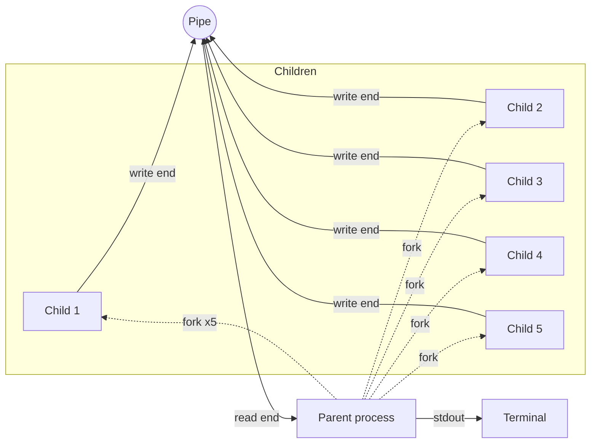

# Multi-Process Pipe IPC in C

Five child processes, one Unix pipe, one parent draining the read end. A small program written for a systems programming course at the University of Western Macedonia, kept around as a reference for how to fan messages from many writers into one reader without losing or interleaving them.

Ships with a multi-stage Dockerfile, so you don't need a C toolchain on the host.

## Architecture



The parent forks five children that share a single pipe. Each child writes 5 messages, one per second. The parent reads until every write end is closed and `read()` returns 0 (EOF), then `wait()`s for each child.

## What it does

- The parent calls `pipe()` to get a `(read_fd, write_fd)` pair, then forks 5 children.
- Each child closes its inherited read end, writes 5 formatted messages into the write end with `dprintf`, closes the write end, and `_exit()`s.
- The parent closes its own write end (this is the part most people get wrong — without it, `read()` blocks forever waiting on an open writer that doesn't exist), then loops on `read()` until EOF.
- After draining the pipe, the parent `wait()`s for each child to avoid zombies.

Each message contains the parent PID, the child PID, and a static identifier string. They land on stdout in arrival order, which means children that get scheduled earlier appear first, but messages from a single child stay in the order that child wrote them.

### Why the messages don't get garbled

Each message is one `write()` call, well under `PIPE_BUF` (4096 bytes on Linux). POSIX guarantees writes of `PIPE_BUF` bytes or fewer are atomic, so two children writing simultaneously can't interleave bytes mid-message — you'll get whole messages in some order, never half of one stitched into half of another. This is the only reason a single shared pipe is safe here without locks.

## Running it

With Docker:

```bash
docker build -t pipe-ipc .
docker run --rm pipe-ipc
```

Without Docker:

```bash
gcc -Wall -o ask4 ask4.c
./ask4
```

The Docker setup uses a multi-stage build: `debian:stable-slim` with `build-essential` for compilation, then just `debian:stable-slim` for the runtime image. The final image is around 80 MB instead of ~300 MB because the compiler and headers don't ship to runtime.

## Files

```
Dockerfile      multi-stage build
ask4.c          the actual program
k4.c            companion exercise from the same coursework
output.txt      sample run
```

## Author

Dimitrios Dalaklidis, final year CS student at the University of Western Macedonia, based in Thessaloniki. Backend and systems work, including 3 merged PRs to Amazon Ion's `fusion-java` runtime, Spring Boot APIs, and FastAPI services with Redis on AWS.

📧 [dalaklidesdemetres@gmail.com](mailto:dalaklidesdemetres@gmail.com) · [GitHub](https://github.com/DimitriosDalaklidhs) · [LinkedIn](https://www.linkedin.com/in/dimitris-dalaklidis-a72838397/)
