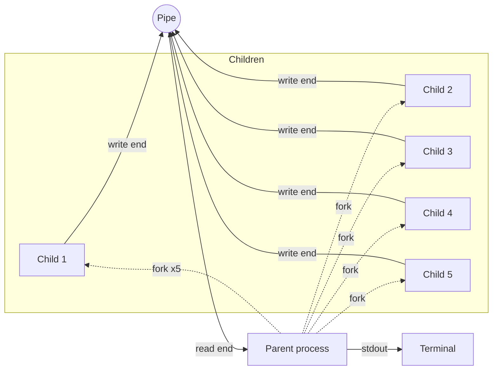

# Multi - Process Pipe Communication in C

This project demonstrates **interprocess communication (IPC)** using a single Unix **pipe** shared among multiple child processes. Each child sends a series of formatted messages to the parent process, which reads and prints them to standard output.

Packaged with a **multi-stage Docker build**, the project requires no local C toolchain, just Docker.

---

## Features

- Creates a pipe for **unidirectional communication**
- Spawns multiple child processes using `fork()`
- **Each child process:**
  - Sends several formatted messages through the pipe
  - Includes its PID, message index, and a static email identifier
- **The parent process:**
  - Reads all incoming messages from the pipe
  - Prints them in the order they arrive (interleaved due to concurrency)
  - Waits for all children to finish, avoiding zombie processes
- **Dockerized** with a multi-stage build, no `gcc` required on the host machine

---

## How It Works

### Architecture



The parent forks five children that share a single pipe. All children write into the write end, the parent drains the read end until every write end is closed and `read()` returns 0 (EOF), then reaps the children with `wait()`.

### 1. Pipe Creation

The parent creates a Unix pipe using `pipe()`:

- `pipe_fd[0]` → **read end**
- `pipe_fd[1]` → **write end**

### 2. Process Creation

The parent forks **5 child processes**. Each child inherits the pipe file descriptors.

### 3. Child Behavior

Each child:

- Closes the unused **read end** of the pipe
- Sends **5 messages**, one per second, each containing:
  - Parent PID
  - Message number
  - Child PID
  - A static email string
- Closes the **write end** and exits

### 4. Parent Behavior

The parent:

- Closes the unused **write end** of the pipe
- Continuously reads all incoming messages from the pipe
- Stops when all children have closed their write ends and `read()` returns `0`
- Calls `wait()` for all children to prevent zombie processes

> **Note on atomicity:** Each message is written in a single `write()` call sized well under `PIPE_BUF` (4096 bytes on Linux). POSIX guarantees these writes are atomic, so messages from concurrent children will not be interleaved or garbled as they arrive as complete units.

---

## Dockerization

This project uses a **multi-stage Dockerfile** to bridge the gap between development and production.

### Why Multi-Stage?

| Stage | Base Image | Purpose |
|---|---|---|
| **Build** | `debian:stable-slim` + `build-essential` | Compiles the C source into a binary |
| **Runtime** | `debian:stable-slim` | Runs only the final binary |

Stripping the compiler and headers from the final image reduces its size from **~300 MB** down to **~80 MB**, so by more than 70 percent and significantly reduces the attack surface.

### How to Run (The DevOps Way)

You don't need `gcc` installed on your machine for this one. Just use Docker:

**1. Build the image:**

```bash
docker build -t unix-process-app .
```

**2. Run the container:**

```bash
docker run --rm unix-process-app
```

The `--rm` flag automatically removes the container after it exits, keeping your environment clean.

---

## Repository Structure

```
├── Dockerfile      # Multi-stage build instructions
├── README.md       # Project documentation 
├── ask4.c          # Main C source code for process management
├── k4.c            # Supporting C source file
└── output.txt      # Sample program output
```

---


### Docker

- If the container exits immediately with no output, confirm `ask4.c` compiled cleanly by checking `docker build` logs for warnings.
- On Linux, you may need to prefix Docker commands with `sudo` unless your user is in the `docker` group.

---

## Author

**Dimitrios Dalaklidis** is an aspiring backend developer with a strong academic foundation in Informatics and hands on experience in systems programming, data structures, and software architecture. His work reflects a methodical approach to problem solving, with practical exposure to diverse language development environments and structured programming disciplines.

His technical interests centre on backend system design, algorithmic efficiency, and the construction of reliable, maintainable software.

📧 [dalaklidesdemetres@gmail.com](mailto:dalaklidesdemetres@gmail.com)
